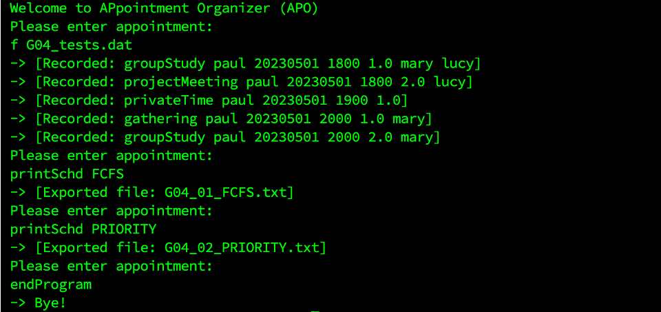
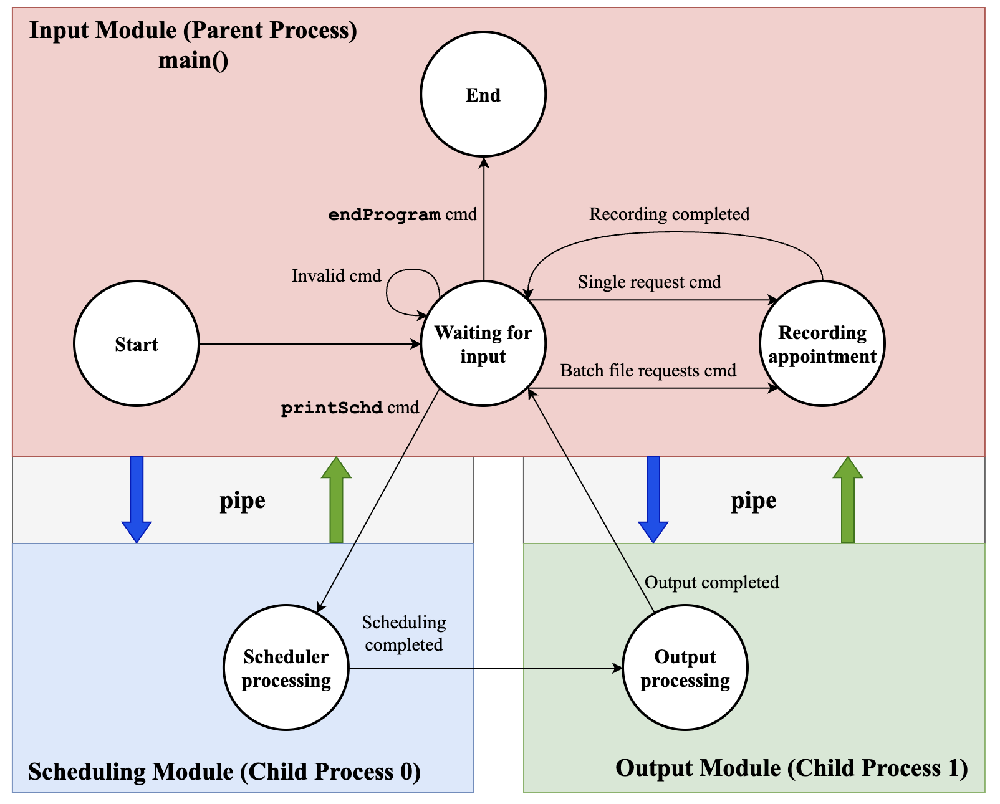
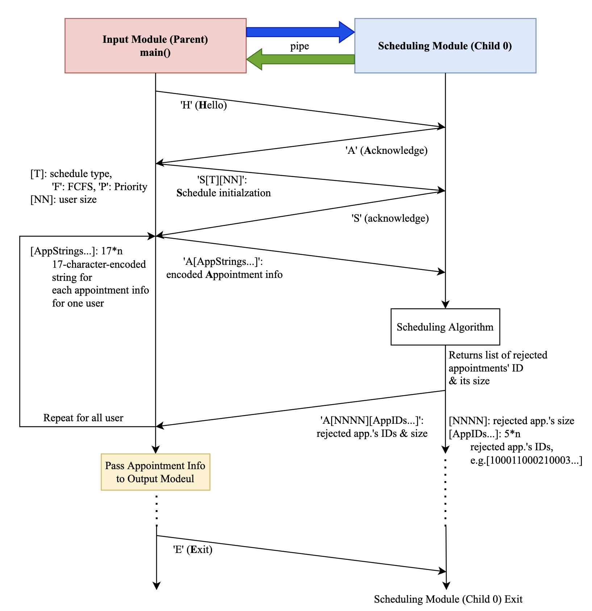
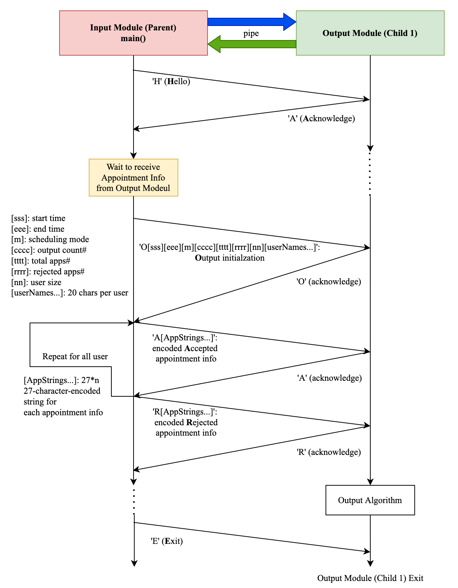
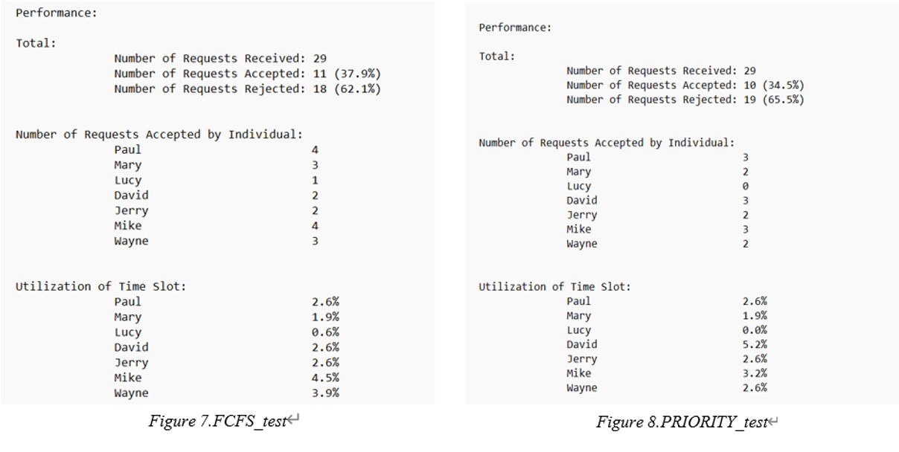

> ***Please carefully read the [Disclaimer of Liability](#disclaimer-of-liability) below first.***  
> All materials in this archive are for reference only. The actual one may vary. 

# Appointment_Organizer_Project

> *A Group Project of Operating Systems (COMP2432) subject at [The Hong Kong Polytechnic University](https://www.polyu.edu.hk/), made by [CHEN Derun](https://github.com/ShanpooO), [LIU Minghao](https://github.com/David-Lmh), [YE Haowen](https://github.com/ShanYu0205), and [ZHANG Wengyu](https://github.com/zhangwengyu999)*

## Group Members

- [CHEN Derun](https://github.com/ShanpooO) 
- [LIU Minghao](https://github.com/David-Lmh)  
- [YE Haowen](https://github.com/ShanYu0205)   
- [ZHANG Wengyu](https://github.com/zhangwengyu999)

---

## Introduction

</img>

APpointment Organizer (APO), enables users to easily organize appointment among their friends.

***PROJECT SCOPE***:
 
- **Process Management**;
- **Interprocess Communication and Programming**;
- **CPU Scheduling**;
- **Process Synchronization**.

***PROJECT CONCEPT***:
- CPU scheduling algorithm: **First Come First Serve**, **Priority**;
- Interprocess communication, synchronization algorithm: **Blocking Send and Blocking Receive**.

***SOFTWARE STRUCTURES***:
Containing three modules, **Input Module**, **Scheduling Module**, and **Output Module**. 

</img>

</img> </img>

- **Input Module** is the parent process who has two child processes for the other two modules. Input Module acts as a coordinator, who is responsible for storing all data structures, handling user input, mapping commands to corresponding functions, and sending and receiving messages between child process through pipe. 
- **Scheduling Module** receives instructions and data from parent process to perform appointment scheduling, as well as sent result back through pipe. 
- **Output Module** receives instructions and data from parent process to perform outputting the scheduled appointment information and corresponding analysis data.

***PERFORMANCE ANALYSIS***

</img>

---

## User Manual

### Preparation
- Environment: Linux
- File checklist:
    - G04_APO.c
    - cmd.txt
    - All_Requests.dat

### To compile the program
`gcc G04_APO.c -o G04_APO`
- There are no additional libraries in the program, use the standard compilation statements.

### To run the program
`./G04_APO [startDate] [endDate] [user1] [user2] ... [user10]`
- For example (used in G04_tests.dat): ./G04_APO 20230501 20230531 paul mary lucy david jerry mike wayne
- The user needs to specify the start date, the end date and the names of all users involved in scheduling at the start of the program. 
- The start and end dates need to be between "20230501" and "20230531", and the end date needs to be greater than the start date. 
- The number of users needs to be greater than three and less than ten. 
- These parameters which are established in the program start statement, cannot be changed during the program.
- Error message in run the program:	
    - User Size out of Range [3,10], try again!
    - Time out of Range [20230501, 20230531], try again!

### To record single appointment
`[type] [caller] [date] [startTime] [duration] [callee1] ... [callee9]`
- For example: gathering lucy 20230504 1900 4.0 john paul mary
- There are four types of programs, in descending order of priority: privateTime, projectMeeting, groupStudy, gathering. 
- All three commands except the privateTime accept several callee users from 1 to 9, while privateTime does not allow callee users. 
- The date needs to be set between the startDate and endDate set in the start command.  
- The caller and callee should be the subset of all users from start command. 
- The startTime is specified as one slot of total five slots between 18:00 and 23:00, 
- the duration cannot be "0" and the startTime plus the duration cannot be more than 23:00.

### To record appointments from batch file
`f [fileName]`
- For example: `f cmd.txt`, or `f All_Requests.dat`
- When the command starts with `f`, the command line function is to read the fileName. 
- The fileName needs to be in the correct format and exist under that folder.

### To print the timetable and the rejected list
`printSchd [Algorithm]`
- For example: `printSchd PRIORITY`
- Use the schedule command to invoke the corresponding Algorithm for scheduling, 
- which includes FCFS, PRIORITY and ALL. 
- The command also calls the Output Module to write the results of the Algorithm to a single file.
- The saved single file name will be shown in the command line.
- The single file contains 
    - Appointment scheduling result for each user, 
    - Rejected appointment list, and 
    - Performance results.

### Error message in appointment record command
- `Event date out of range`: entered appointment data is out of set data range
- `Event time out of range`: entered appointment time is out of set time range
- `Event duration out of range`: entered appointment duration is out of set time range 
- `Caller not found`: entered appointment’s caller is not found among all users
- `No callee can be in privateTime`: callees are found in entered privateTime appointment
- `At least one callee should be in this appointment`: no callee in non-privateTime appointment
- `Callee not found`: entered appointment’s callees are not found among all users

### To end the program
`endProgram`
- This ends the program completely, upon collecting all the child processes and closing all the files.

---

## Disclaimer of Liability

**The material and information contained on this website is for general information, reference, and self-learning purposes only. You should not rely upon the material or information on the website as a basis for making any academic, business, legal or any other decisions. You should not copy any material or information on the website into any of your academic, business, legal or any other non-private usages. ZHANG Wengyu will not be responsible for any consequences due to your violations.**

Whilst ZHANG Wengyu endeavours to keep the information up to date and correct, ZHANG Wengyu makes no representations or warranties of any kind, express or implied about the completeness, accuracy, reliability, suitability or availability with respect to the website or the information, products, services or related graphics contained on the website for any purpose. Any reliance you place on such material is therefore strictly at your own risk.

ZHANG Wengyu will not be liable for any false, inaccurate, inappropriate or incomplete information presented on the website.

Although every effort is made to keep the website up and running smoothly, due to the nature of the Internet and the technology involved, ZHANG Wengyu takes no responsibility for and will not be liable for the website being temporarily unavailable due to technical issues (or otherwise) beyond its control or for any loss or damage suffered as a result of the use of or access to, or inability to use or access this website whatsoever.

Certain links in this website will lead to websites which are not under the control of ZHANG Wengyu. When you activate these you will leave ZHANG Wengyu's  website. ZHANG Wengyu has no control over and accepts no liability in respect of materials, products or services available on any website which is not under the control of ZHANG Wengyu.

To the extent not prohibited by law, in no circumstances shall ZHANG Wengyu be liable to you or any other third parties for any loss or damage (including, without limitation, damage for loss of business or loss of profits) arising directly or indirectly from your use of or inability to use, this site or any of the material contained in it.
